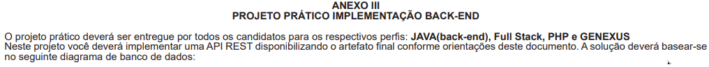
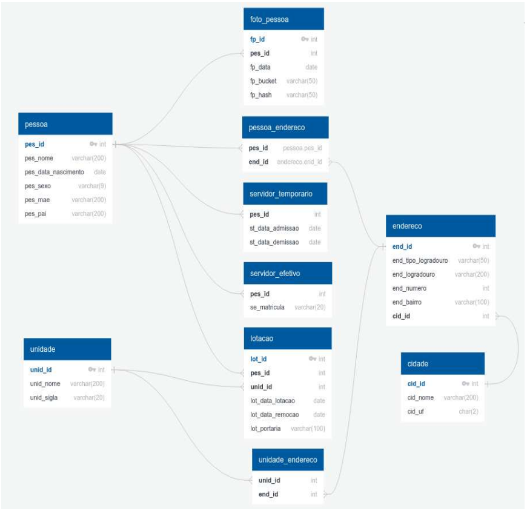
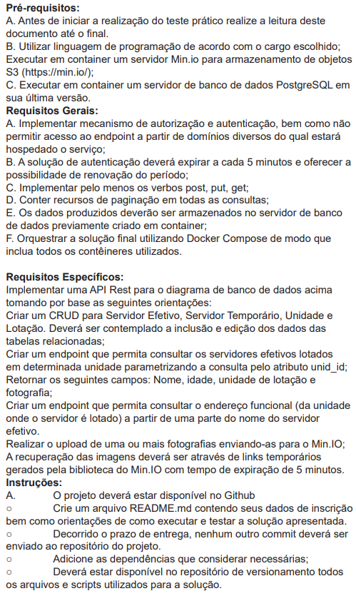

# PROJETO PRÁTICO IMPLEMENTAÇÃO BACK-END: API REST - Gestão de Servidores

Esta aplicação é uma API feita para gerenciar informações de servidores, unidades, lotações e também para fazer upload de fotos. Ela foi construída usando **Laravel 12**.

## Dados de Inscrição

- **Nome:** Alexandre dos Santos Freire Ferreira
- **Repositório:** [https://github.com/oalexandrefreire/SEPLAG_BackEnd](https://github.com/oalexandrefreire/SEPLAG_BackEnd)


## Como Rodar o Projeto com Docker

1. **Pré-requisitos**:
    - Ter o **Docker** e o **Docker Compose** instalados na máquina.

2. **Passos**:
    - Clone o projeto para sua máquina:
      ```bash
      git clone https://github.com/oalexandrefreire/SEPLAG_BackEnd
      cd SEPLAG_BackEnd
      ```
    - Copie o arquivo de exemplo `.env.example` para `.env` e configure as variáveis de ambiente, como banco de dados e MinIO.
      ```bash
      cp .env.example .env
      ```
    - Suba os containers com o Docker Compose:
      ```bash
      docker-compose up -d
      ```

3. **Acessando a API**:
    - A API estará disponível em `http://localhost:8000`.
    - A documentação completa da API está disponível no Postman:
 <a href="https://documenter.getpostman.com/view/3438688/2sB2cX9MKL" target="_blank">👉 Abrir documentação no Postman</a>


## Observações
- No cadastro de servidores(efetivo e temporário) e unidades, a cidade pode ser informada de duas maneiras:
  - **cid_id**: ID da cidade já existente.
  - **cid_nome** e **cid_uf**: Nome e UF da cidade, que serão usados para buscar ou criar a cidade.
  - Também foi criado um endpoint para criar, alterar e listar cidades.


- O upload de fotos se da seguinte maneira: 
  - Através do cadastro do servidor(efetivo e temporário) no campo opcional `fotos[]`.
  - Ou através do endpoint `/api/foto/upload/$PES_ID` informando no campo `fotos[]` no body.
  - Também foi criado endpoint específico para listar as fotos em `/api/foto/$PES_ID`. Ao visualizar os detalhes do servidor também é gerado links temporários das fotos dele.

## Regras do Edital
Abaixo você pode visualizar informações importantes extraídas do edital, como regras, estrutura e fluxo do processo:




